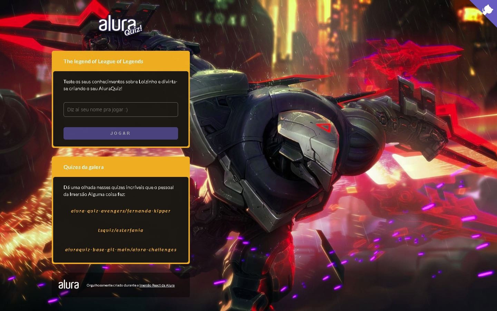

# LoLzinquiz

Projeto realizado durante a semana da Imersão ReactJS e NextJS. Onde foi proposta para que fosse criado uma aplicação de um Quiz.

## Tecnologias utilizadas

- Javascript
- ReactJS
- Next
- Styled-Components

## Imagem do projeto

## Apresentação do projeto

### Apresentação da parte dos quizes da galera

### Notes
